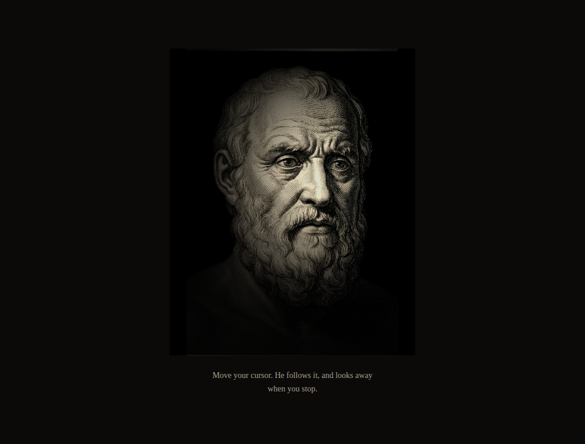

# argus

Engraved portraits that watch your cursor.

A WebGL2 rig that takes a flat print, a grayscale depth map beside it and a
handful of measured numbers, and gives the sitter a head that turns and eyes that
follow. No 3D model, no face detection, no per-frame CPU work beyond a little
damping: the whole effect is one fragment shader reading the print at a displaced
coordinate.

It has no runtime dependencies, ships ESM with types, and needs WebGL2. It does
not own a render loop or a pointer listener, because a wall of nine portraits
wants one of each and not nine.

Not every portrait can carry the effect. The two conditions that decide it are
in [Calibrating a plate of your own](#calibrating-a-plate-of-your-own), and they
are worth reading before you pick an image.

## The two-layer warp

**The head turns on a depth map.** The depth map is grayscale, the same pixel
dimensions as the print, white nearest. Every fragment shifts the coordinate it
samples the print at by `(depth - 0.5) * amp * mouse`, so a nose at 0.85 travels
one way, a background at 0.15 travels the other, and near features move further
than far ones. That difference is the whole illusion of a head rotating. Nothing
is modelled and no geometry exists; it is a texture read at a moved address, and
its cost is one extra sample per fragment.

**The eyes move separately, and faster.** On top of that shifted coordinate each
eye adds an offset of its own, confined by two measured ellipses. The gain is
exactly 1 inside the **iris** ellipse, so the drawn disc translates rigidly and
never deforms, and eases to 0 at the **rim** ellipse, so the eyelid is never
dragged. Two ellipses rather than one plus a feather, because the room an eye has
is genuinely anisotropic: a wide-open eye leaves half its width free horizontally
while the iris nearly fills the fissure vertically.

The eyes are damped harder than the head (0.2 against 0.08), so they arrive at a
new target first and the head follows. That is the order a real face does it in,
and getting it backwards is most of why a naive version reads as a puppet.

A candle-style lamp follows the cursor in screen space over the top of both
layers, so a plate the pointer is nowhere near sits at an ambient floor and is
discovered by sweeping toward it.

## Install

```bash
pnpm add @memormaneo/argus
```

## Usage

```ts
import { createRig, createGazeClock, phaseFor } from "@memormaneo/argus";

const clock = createGazeClock();
const rig = createRig({
  canvas,          // <canvas> inside host
  host,            // the element whose layout box sizes the buffer
  plate: { ...myPlate, phase: phaseFor(0) },
  albedo: "/plates/mine/albedo.jpg",
  depth: "/plates/mine/depth.png",
});

// createRig returns null when WebGL2 is unavailable, and hides the canvas.
// Put an  of the plate underneath and it shows through on its own.
if (rig) {
  clock.subscribe((f) => {
    const lit = rig.frame({ t: f.t, pointer: f.pointer, sinceMoveMs: f.sinceMoveMs, flick: f.flick });
    host.style.setProperty("--lit", String(lit));
  });
}
```

`createGazeClock()` is one `requestAnimationFrame` loop, one pointer listener and
one flame for the whole page, and it pauses itself when the tab is hidden. Make
one and subscribe every plate to it. `phaseFor(index)` offsets each sitter's
glance clock so that a wall of them does not blink and look away in chorus.

The rest of the handle: `rig.resize(scale?)` re-allocates the drawing buffer from
the host's layout box (drive it from a `ResizeObserver`), `rig.still()` draws one
deterministic neutral frame for reduced-motion or non-pointer visitors, and
`rig.destroy()` releases the GL objects.

## When there is no WebGL2

`createRig` returns `null`. It warns once, sets `canvas.style.display = "none"`,
and that is the entire fallback: put an `` of the same print underneath the
canvas and it becomes visible on its own.

This is a contract and not an error path, so treat the `null` branch as normal.
The canvas is created with `alpha: true` for the same reason. An undrawn WebGL
buffer composites as transparent, so the print shows through while the textures
are still loading, and it shows through on the throw path too, where setup fails
after the context exists.

## What `frame()` returns

A number from 0 to 1: how lit the **centre of this plate** is, computed from the
same falloff the shader burns.

It exists because the shader only ever lights the pixels it draws. Anything the
page puts around the print, a moulding, a gilt frame, a caption, is DOM that no
shader touches, so without a number crossing back out of the rig a cursor that
leaves a print at its ambient floor leaves its frame at full brightness, and the
result reads as an empty frame with a dark hole in it. Write the value onto a CSS
custom property, as the example does, and let the surround dim with the print.

It deliberately mirrors less than all of the shader's light: not the candle sway
added to the lamp position, worth about 0.01, and not the specular term, which
wants a depth map the CPU has not got. Both of those breathe with the flame, so
mirroring them would rewrite style on every framed element every frame at rest.

## The plate

A plate is a `GazePlate` object plus two image URLs. The shader is generic; what
is per-portrait is this record.

```ts
type GazePlate = {
  slug: string;                      // names the plate in warnings
  eyes: {
    l: { iris: Ellipse; rim: Radii }; // Ellipse: { cx, cy, rx, ry }
    r: { iris: Ellipse; rim: Radii }; // Radii:   { rx, ry }
  };
  gaze: {
    maxX: number;        // pupil travel in UV, horizontal
    maxY: number;        // pupil travel in UV, vertical
    restDown: number;    // lowers the neutral gaze, for artwork drawn looking up
    restR: { x: number; y: number };  // per-eye rest correction, 3/4 poses only
    lidFade: number;     // 0..1, fades the down-warp near a clipped upper lid
    lidFollow: number;   // 0..1, how much of the vertical gaze the lid carries
    lidReach: number;    // where the lid's motion dies, as a multiple of the rim
  };
  amp: number;           // head-turn amplitude; 0.045 is known good
  phase: number;         // glance-clock offset; set it with phaseFor(index)
};
```

Ellipses are stored in **image coordinates**: top-left origin, y down, fractions
of width and height, exactly as you read them off the picture. The flip to GL UV
happens once, at the uniform upload, and nowhere else. Store what you measured.

`example/plate.ts` is a fully calibrated plate with the argument for every number
written beside it. It is the best documentation of the format there is, because
each field is next to the artefact it was set to repair.

The two images: `albedo` is the print itself, `depth` is a grayscale map at the
same pixel dimensions with white nearest. `tools/plate/depth.py` produces the
second from the first.

## Calibrating a plate of your own

Read [`PLATES.md`](PLATES.md). The Python toolkit it drives is in
[`tools/plate/`](tools/plate/): tone comparison, 4:5 derivation, depth estimation
and feathering, a UV grid overlay, an eye-band upscaler, an ellipse overlay, and a
renderer that applies both warps at full travel so a bad fit is visible rather
than theoretical.

```bash
python3 -m venv .venv && . .venv/bin/activate
pip install -r tools/plate/requirements.txt
```

That is numpy, pillow and scipy, and it covers seven of the eight tools.
`depth.py` additionally needs torch and transformers, a multi-gigabyte install
and a model download, because it runs Depth Anything V2 Small to estimate a map.
Install those only if you need one generated.

The toolkit was written inside a private gallery and still defaults to that
gallery's asset layout, `public/plates/<slug>/`, so most tools want a path
argument pointing somewhere else. `warp.py` needs two, `--plates` with the plate
record as JSON and `--dir` with the images, because it reads a record rather than
just a file; `PLATES.md` shows the one-liner that produces that JSON.

Be clear about what this costs. **Calibrating a plate is measurement work, not a
config tweak.** You read numbers off the picture, draw them back over it, look,
and adjust, usually two or three rounds. A near-frontal pose with both eye sockets
lit takes about ten minutes. A three-quarter turn with one eye in shadow takes an
afternoon.

Two conditions decide whether a plate will work at all, and both are about the
eyes:

1. **The full circle of each iris is visible**, unclipped by the eyelid. The
   eyelid is a hard line and the warp will drag it.
2. **Clean, unhatched white shows on both sides of each iris**, on the nose side
   as well as the outer side. That white is the travel room, and the pupil needs
   somewhere to go.

An image that fails either one is worth replacing rather than calibrating around.
`PLATES.md` has the full acceptance list and the reasons behind it.

For writing your own gates, `@memormaneo/argus/testing` exports the GLSL warp
mirrored in TypeScript, including `foldTravel()`, which computes the travel at
which a given iris and rim pair makes the sampling map fold back on itself. That
is the hard ceiling on `maxX`, and a pupil pushed past it stops being a disc.

```ts
import { foldTravel } from "@memormaneo/argus/testing";
```

## Running the example

```bash
pnpm install
pnpm build
python3 -m http.server 11801 --bind 127.0.0.1
```

Then open <http://127.0.0.1:11801/example/>. The build step compiles
`example/*.ts` into `example/build/`, because the browser cannot run the
TypeScript that the test suite imports as a typed fixture.



## Licences

Two, and the split matters.

- **The code is MIT.** Everything under `src/`, `test/`, `tools/` and
  `example/*.ts`. Use it for anything, commercial included. See [`LICENSE`](LICENSE).
- **The example images are CC BY-NC 4.0.** `example/albedo.jpg` and
  `example/depth.png` only. They are here so the example runs and so there is a
  worked calibration to read. For anything commercial, bring your own plate.

The sitter is a generated engraving, not a scan of a historical print. He depicts
nobody, carries no provenance and no museum holds him. See [`NOTICE.md`](NOTICE.md).
